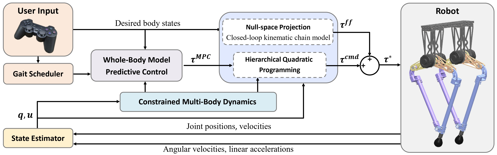

# MPC-HQP-Parallel-Robot

[](https://opensource.org/licenses/BSD-3-Clause)

> [!NOTE]
> **The code will be made public after the IROS 2025 paper is accepted.**

## Introduction

A whole-body Model Predictive Control and Hierarchical Quadratic Programming (MPC-HQP) framework, specifically tailored for bipedal robots with kinematic loops.

## Control architecture

<p align="center">
  
</p>

## Installation

### Install Webots

Download the Webots R2021a from the github release page: [Webots R2021a](https://github.com/cyberbotics/webots/releases/tag/R2021a)

### Install Pinocchio and Crocoddyl

If you haven’t added the `robotpkg` repository, do so first:
```
sudo apt install -qqy lsb-release gnupg2 curl
echo "deb [arch=amd64] http://robotpkg.openrobots.org/packages/debian/pub $(lsb_release -cs) robotpkg" | sudo tee /etc/apt/sources.list.d/robotpkg.list
curl http://robotpkg.openrobots.org/packages/debian/robotpkg.key | sudo apt-key add -
sudo apt update
```

Then install `Pinocchio` and `Crocoddyl`:
```
sudo apt install -qqy robotpkg-py3*-pinocchio
sudo apt install -qqy robotpkg-py3\*-crocoddyl
```

### Install Proxsuite from source

Install `simde`:
```
tar -xzvf simde.tar.gz
sudo cp -r ./simde /usr/include/simde
```

Build and install `Proxsuite`:
```
tar -xzvf proxsuite-0.6.7.tar.gz
cd proxsuite-0.6.7
mkdir build && cd build
cmake .. -DCMAKE_BUILD_TYPE=Release -DBUILD_WITH_VECTORIZATION_SUPPORT=ON -DBUILD_TESTING=OFF
make
sudo make install
```

### Build the project

```
git clone git@github.com:Sang-SC/MPC-HQP-Parallel-Robot.git
cd MPC-HQP-Parallel-Robot
mkdir build && cd build
cmake ..
make -j$(nproc)  # Use all available cores to compile
```

### Configure environment variables

Copy the following code into the `.bashrc` file.
```bash
# Webots related environment variables
export WEBOTS_HOME=/usr/local/webots
export PYTHONPATH=$PYTHONPATH:/usr/local/webots/lib/controller/python38
export LD_LIBRARY_PATH=/usr/local/webots/lib/controller

# robotpkg related environment variables
export PATH=/opt/openrobots/bin:$PATH
export PKG_CONFIG_PATH=/opt/openrobots/lib/pkgconfig:$PKG_CONFIG_PATH
export LD_LIBRARY_PATH=/opt/openrobots/lib:$LD_LIBRARY_PATH
export PYTHONPATH=/opt/openrobots/lib/python3.10/site-packages:$PYTHONPATH

# project related environment variables
export PARALLEL_ROBOT_PROJECT_PATH="Path to project"  # For example: /home/robot/robot_projects/MPC-HQP-Parallel-Robot
export PARALLEL_ROBOT_LOGGER_FILE_PATH=$PARALLEL_ROBOT_PROJECT_PATH/logs/
export PARALLEL_ROBOT_URDF_MODEL_PATH=$PARALLEL_ROBOT_PROJECT_PATH/core/models/parallel_robot.urdf
export PARALLEL_ROBOT_YAML_FILE_PATH=$PARALLEL_ROBOT_PROJECT_PATH/config/control_parameters_sim.yaml
export PARALLEL_ROBOT_SIM_FLAG=ON
```

## Usage

To run the simulation:
```
webots core/worlds/world_walk.wbt
./build/core/main_simulation
```

## Contact

For questions or assistance, feel free to open an issue on GitHub.

## Acknowledgement

[spdlog](https://github.com/gabime/spdlog): A fast C++ logging library.

[yaml-cpp](https://github.com/jbeder/yaml-cpp): A YAML parser and emitter in C++.

[proxsuite](https://github.com/Simple-Robotics/proxsuite): The Advanced Proximal Optimization Toolbox.

[pinocchio](https://github.com/stack-of-tasks/pinocchio): A fast and flexible implementation of Rigid Body Dynamics algorithms and their analytical derivatives.

[crocoddyl](https://github.com/loco-3d/crocoddyl): An optimal control library for robot control under contact sequence.

[lcm](https://github.com/lcm-proj/lcm): A set of libraries and tools for message passing and data marshalling, targeted at real-time systems where high-bandwidth and low latency are critical.

[gainput](https://github.com/jkuhlmann/gainput): A cross-platform C++ input library supporting gamepads, keyboard, mouse, touch.

[Cheetah-Software](https://github.com/mit-biomimetics/Cheetah-Software): The project of MIT Cheetah3 and MiniCheetah.
